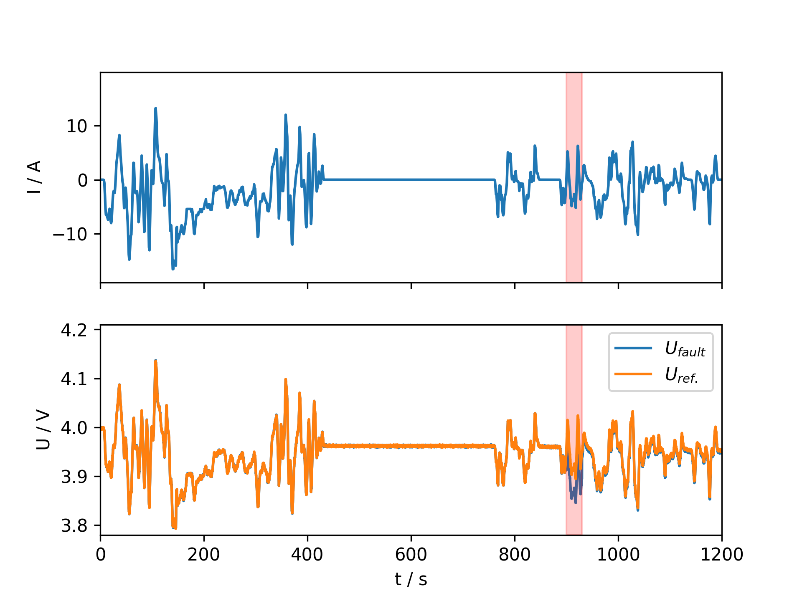
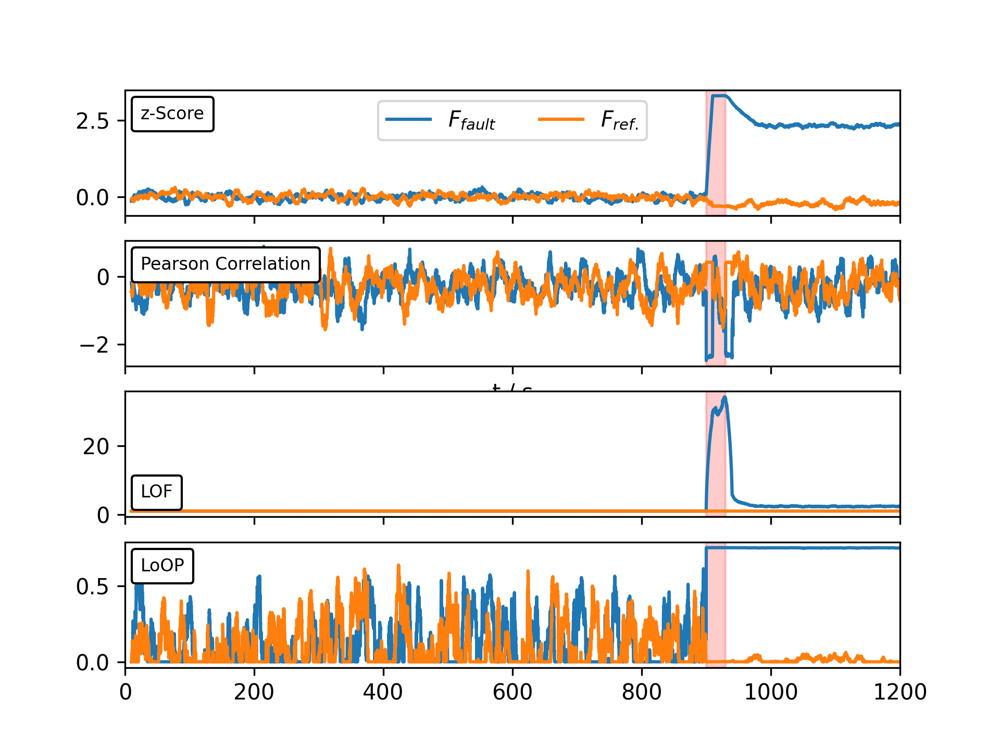

# BattDiag Examples

This directory contains example notebooks and sample data to demonstrate BattDiag functionality.

## Contents

- **`sample_data.csv`**: Battery voltage data from WLTC-based test case with internal short circuit (ISC) fault
  - Based on simplified test case described in supplementary chapter S2 of the manuscript
  - Contains segments with dynamic load and rest phases for 12 cells
  - Voltage signals contain noise with 1mV
  - Static ISC fault: 
    - Faulty cell: 1
    - $t_\mathrm{ISC} = 900\mathrm{s}$
    - $R_\mathrm{ISC} = 1\Omega$ 
    - $\Delta t_\mathrm{ISC} = 30\mathrm{s}$
  
- **`demo.ipynb`**: Interactive demonstration notebook showing:
  - Loading and visualizing battery data with fault scenarios 
  - Calculating exemplary fault signals
  - Visualization of the fault signals that clearly highlight the simulated ISC fault 


## Using your own data

To use BattDiag with your own battery data:

1. Format your data as numpy array with `(T,N)` shape, where `T` is the time index and `N` the individual cells (columns)
2. Apply diagnostics as given below. Please note, that due to the numba-implementation of most algorithms even optional parameters must be provided. 

```python
result = crossCellEval.numba_rolling_PearCorr(data, 100,8, preProcessing="None", preParameters=List([10.0]),  midProcessing = "None", midParameters=List([0.1,2.0]), postProcessing="zScore", postParameters=List([1.0]))

```

